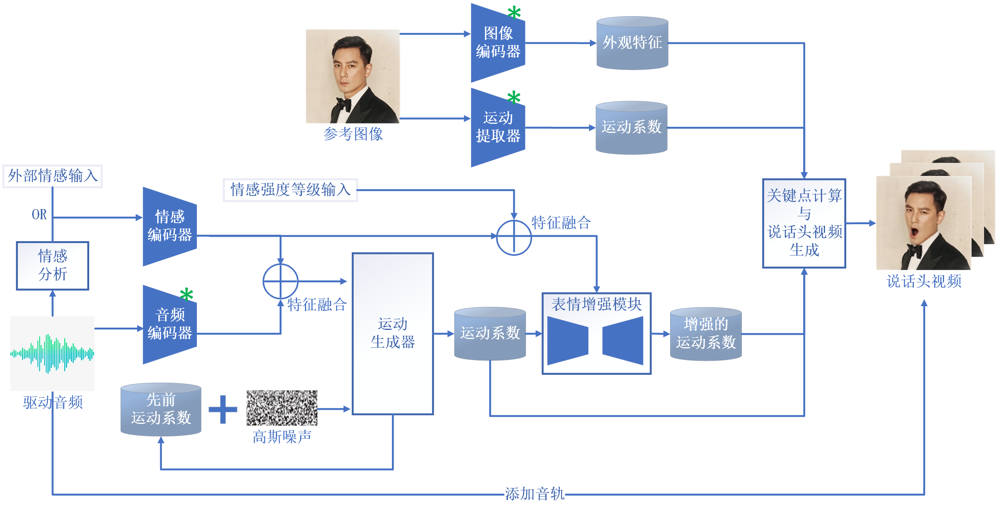

<h1 align='center'>音频驱动的情感融合说话视频生成的研究</h1>
<h2 align='center'>ADEF: Research on Audio-Driven
Emotion-Fused Talking Video Generation</h2>

## 📖 项目介绍

## 🧳 框架



## ⚙️ 模型部署

**系统配置:**

Ubuntu:

- 训练&测试：Ubuntu 20.04, CUDA 12.1
- 训练&测试：GPUs: RTX 4090

Windows:

- 建议 Windows 11, CUDA 12.1
- 建议 GPUs: RTX 4060 Laptop 8GB VRAM GPU

**创建环境:**

```bash
# 1. Create base environment
conda create -n adef python=3.10.16 -y
conda activate adef 

# 2. Install requirements
pip install -r requirements.txt

# 3. Install ffmpeg
sudo apt-get update  
sudo apt-get install ffmpeg -y
```

## 🎒 下载模型检查点

确保系统安装了[git-lfs](https://git-lfs.com)。并将模型检查点下载到`pretrained_weights`目录。

### 1. 下载我们的 ADEF 检查点

```bash
git lfs install
git clone https://huggingface.co/ZhouXSh/ADEF
```

### 2. 下载音频编码器检查点

We suport two types of audio encoders, including [wav2vec2-base](https://huggingface.co/facebook/wav2vec2-base-960h), and [hubert-chinese](https://huggingface.co/TencentGameMate/chinese-hubert-base).

Run the following commands to download [hubert-chinese](https://huggingface.co/TencentGameMate/chinese-hubert-base) pretrained weights:

```bash
git lfs install
git clone https://huggingface.co/TencentGameMate/chinese-hubert-base
```

To get the [wav2vec2-base](https://huggingface.co/facebook/wav2vec2-base-960h) pretrained weights, run the following commands:

```bash
git lfs install
git clone https://huggingface.co/facebook/wav2vec2-base-960h
```

### 3. Download LivePortraits checkpoints

```bash
# !pip install -U "huggingface_hub[cli]"
huggingface-cli download KwaiVGI/LivePortrait --local-dir pretrained_weights --exclude "*.git*" "README.md" "docs"
```

Refering to [Liveportrait](https://github.com/KwaiVGI/LivePortrait/tree/main) for more download methods.

### 4. 预训练模型（`pretrained_weights` 目录）结构

`pretrained_weights`目录最终是以下层级关系：

```text
./pretrained_weights/
├── ADEF
│   ├── audio2emo
│   │   └── audio2emo.pth
│   ├── emo_classifier
│   │   └── emo_level_classifier.pth
│   ├── emo_enhancer
│   │   └── emo_enhancer.pth
│   ├── motion_generator
│   │   └── motion_generator.pt
│   └── motion_template
│       └── motion_template.pkl
├── insightface                                                                                                                                                 
│   └── models                                                                                                                                                  
│       └── buffalo_l                                                                                                                                           
│           ├── 2d106det.onnx                                                                                                                                   
│           └── det_10g.onnx   
├── liveportrait
│   ├── base_models
│   │   ├── appearance_feature_extractor.pth
│   │   ├── motion_extractor.pth
│   │   ├── spade_generator.pth
│   │   └── warping_module.pth
│   ├── landmark.onnx
│   └── retargeting_models
│       └── stitching_retargeting_module.pth
├── TencentGameMate:chinese-hubert-base
│   ├── chinese-hubert-base-fairseq-ckpt.pt
│   ├── config.json
│   ├── gitattributes
│   ├── preprocessor_config.json
│   ├── pytorch_model.bin
│   └── README.md
└── wav2vec2-base-960h               
    ├── config.json                  
    ├── feature_extractor_config.json
    ├── model.safetensors
    ├── preprocessor_config.json
    ├── pytorch_model.bin
    ├── README.md
    ├── special_tokens_map.json
    ├── tf_model.h5
    ├── tokenizer_config.json
    └── vocab.json
```

> [!NOTE]
> Windows中的文件夹“TencentGameMate:chinese hubert base”应重命名为“chinese hubert base”。

## 🚀 推理

### 0. 一些重要参数

| 参数   | 含义 | 取值范围            |
|--------|------|------------------|
| -r   | 被驱动的人脸图像   | 图像路径，字符串       |
| -a   | 驱动音频   | 音频路径，字符串         |
| -e   | 情感类型   | angry、contempt、disgusted、fear、happy、neutral、sad、surprised   |
| --cfg_scale   | CFG权重   | 建议>1 & <4，数字   |
| --output_dir   | 生成视频保存目录   | 目录路径，字符串  |
| --use_emo_enhancer  | 是否使用情感增强   | True or False   |
| --enhance_level   | 情感增强的级别   | 1、2、3 数字   |
| --use_emo_analyzer   | 是否对音频进行情感分析   | True or False    |
| --device_id   | GPU编号   | 看您有几个GPU，数字   |
### 1. 使用命令行推理

可以添加上述的参数

```python
python inference.py
```

您可以更改cfg_scale以获得不同表情和头部姿势的结果。

### 2. 使用web demo推理

使用以下命令启动网页演示:

```python
python app.py
```

演示将运行在http://127.0.0.1:7862.

## ⚓️ 使用自己的数据训练模型

本方法使用[MEAD](https://github.com/uniBruce/Mead)进行训练。

数据要求：人类说话的面部视频、情感类型标签、情感强度等级标签。

数据准备时，应该按照以下结构层次和命名规则：

```text
./dataset/
└── MEAD
    └── videos
        ├── M003
        ├── M005
            └──front
                ├──angry
                    ├──level_1
                        ├──M005_front_angry_level_1_001.mp4
                        ├──M005_front_angry_level_1_002.mp4
                        ├──......
                        └──M005_front_angry_level_1_029.mp4
                    ├──level_2
                    └──level_3
                ├──contempt
                ├──disgusted
                ├──fear
                ├──happy
                ├──neutral
                ├──sad
                └──surprised
        ├── M007
        ├── ...
        └── W040
```

### 1. 准备训练与测试数据

使用您自己的数据集路径更改“01_extract_gt_motions.py”和“01_extract_dit_motions”中的“root_dir”，然后运行以下命令以生成训练和验证数据：

```bash
cd src/prepare_data
python 01_extract_gt_motions.py
python 05_extract_audio.py
python 02_divide_dataset.py
pyhton 03_merge_gt_motions.py
python 04_generate_template.py
```

训练情感增强模块，需要额外执行以下操作（需要确保运动生成器已完成训练）：
```bash
python 01_extract_dit_motions.py
python 03_merge_dit_motions.py
```

训练音频情感识别模块，需要额外执行以下操作（需要用到[emotion2vec](https://github.com/ddlBoJack/emotion2vec) ）：
```bash
python 06_extract_emotion2vec.py
```

### 2. 训练

首先，训练情感分类器，以用于计算情感损失：

```bash
python train_emoClassifier.py
```

其次，训练我们的运动生成器。可以更改其中的参数，以个性化训练：

```bash
python train.py
```

再次，训练情感增强模块。需要在运动生成器的基础上进行：
```bash
python train_emoEnhancer.py
```

最后，如有需要，可以训练音频情感分类器：
```bash
python train_audio2emotion.py
```
实验结果位于： `experiments/`.

## 🤝 感谢

We would like to thank the contributors to the 
[JoyVASA](https://github.com/KwaiVGI/LivePortrait),
[emotion2vec](https://github.com/ddlBoJack/emotion2vec), [LivePortrait](https://github.com/KwaiVGI/LivePortrait), [Open Facevid2vid](https://github.com/zhanglonghao1992/One-Shot_Free-View_Neural_Talking_Head_Synthesis), [InsightFace](https://github.com/deepinsight/insightface), [X-Pose](https://github.com/IDEA-Research/X-Pose), [DiffPoseTalk](https://github.com/DiffPoseTalk/DiffPoseTalk), [Hallo](https://github.com/fudan-generative-vision/hallo), [wav2vec 2.0](https://github.com/facebookresearch/fairseq/tree/main/examples/wav2vec), [Chinese Speech Pretrain](https://github.com/TencentGameMate/chinese_speech_pretrain), [Q-Align](https://github.com/Q-Future/Q-Align), [Syncnet](https://github.com/joonson/syncnet_python), and [VBench](https://github.com/Vchitect/VBench) repositories, for their open research and extraordinary work.
